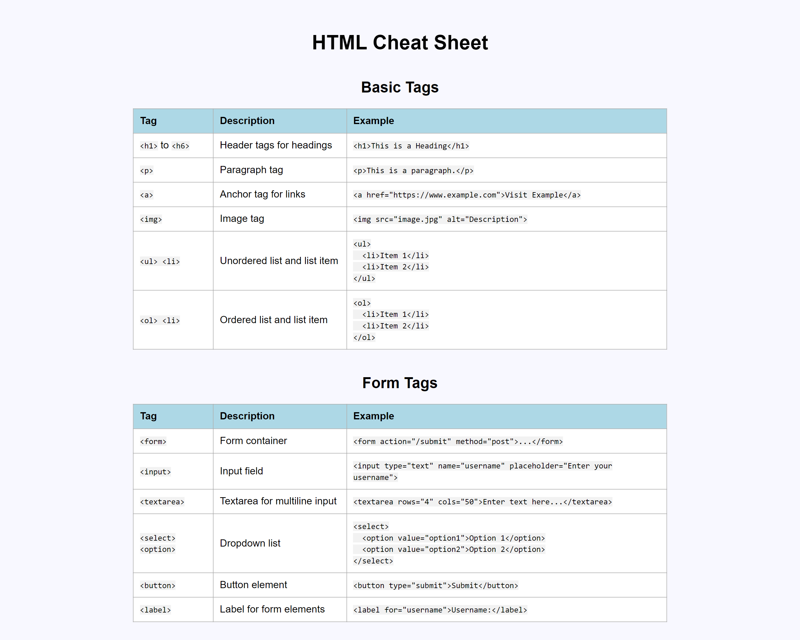

# HTML Cheat Sheet

A reference HTML cheat sheet that has two tables: Basic Tags and Form Tags.

This is a challenge project for CodeCademy Full-Stack Engineer course.

## Table of Contents

- [Screenshots](#screenshots)
- [Deployment](#deployment)
- [Usage](#usage)
- [Questions](#questions)

## Screenshots

## Deployment

[API Documentation Page](https://zolotavina.github.io/cheat-sheet/)

## Usage

Click on the [link](https://zolotavina.github.io/cheat-sheet/) to access HTML Cheat Sheet.

## Questions

Open an issue if you have any questions about the repo. You can find more of my work [here](https://github.com/zolotavina).